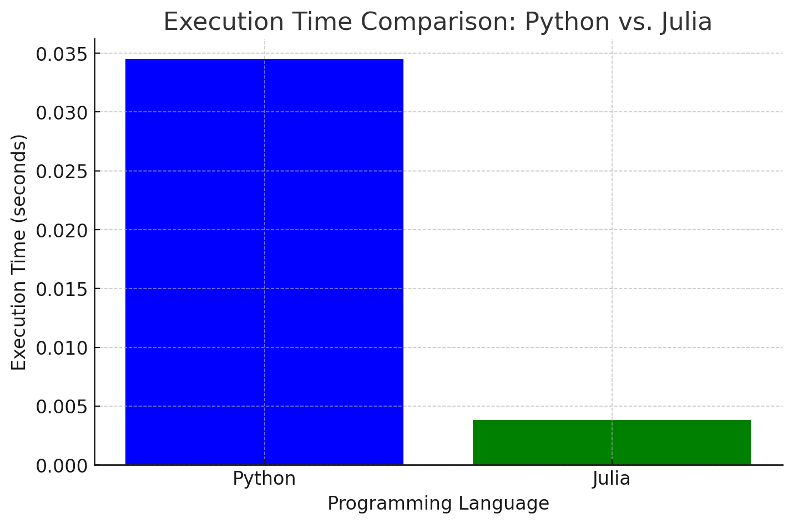

# Monte carlo Simulation for European Option Pricing

This repository contains code to run a Monte Carlo simulation to price a European call option in both Python and Julia. The aim is to compare the performance of the two languages in terms of execution time.

## Running the Simulations

### Python

Ensure you have `numpy` installed:
```
pip install numpy
```

Then, run:
```
python monte_carlo_python.py
```

### Julia

Ensure you have the `Distributions` package installed:
```
using Pkg
Pkg.add("Distributions")
```

Then, run:
```
julia monte_carlo_julia.jl
```

## Execution Time Visualization


